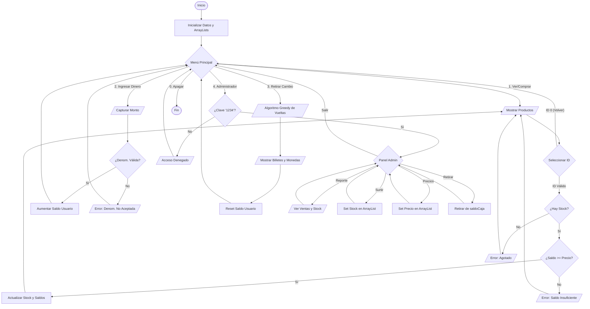

# Máquina Expendedora Pro - Contexto Colombia 🇨🇴

Esta es una aplicación de consola desarrollada en **Java** que simula el funcionamiento completo de una máquina expendedora de snacks y bebidas. El proyecto está diseñado bajo un paradigma **procedural (sin Programación Orientada a Objetos)**, utilizando `ArrayList` para el almacenamiento dinámico de datos.

## ✨ Características Principales

### 👤 Modo Cliente
- **Visualización de Inventario**: Lista de productos con ID, nombre, precio (COP) y stock disponible.
- **Ingreso de Dinero**: Soporta denominaciones colombianas reales ($50, $100, $200, $500, $1.000, $2.000, $5.000, $10.000).
- **Lógica de Compra**: Validación automática de saldo suficiente y existencias de productos.
- **Desglose de Vueltas**: Al retirar el cambio, el sistema calcula y entrega la combinación óptima de billetes y monedas.

### 🔐 Modo Administrador
- **Protección**: Acceso restringido mediante clave de seguridad (Default: `1234`).
- **Gestión de Stock**: Opción para surtir productos y reponer existencias.
- **Control de Precios**: Ajuste dinámico de los precios de venta.
- **Auditoría de Caja**: Visualización del total de ventas históricas y efectivo disponible en caja para retiro.

---

## 🚀 Cómo Ejecutar la Aplicación

1. **Requisitos**: Tener instalado el JDK (Java Development Kit) versión 8 o superior.
2. **Compilación**: Desde la terminal en la raíz del proyecto, ejecuta:
   ```bash
   javac src/App.java
   ```
3. **Ejecución**:
   ```bash
   java -cp src App
   ```

---

## 🛠️ Guía de Uso

### Para comprar un producto:
1. Selecciona la opción **2** para ingresar dinero (puedes ingresar varias veces hasta completar el monto deseado).
2. Selecciona la opción **1** para ver los productos.
3. Ingresa el **ID** del producto que deseas.
4. Si el saldo es suficiente y hay stock, la máquina te entregará el producto.
5. Selecciona la opción **3** para recibir tus vueltas desglosadas en billetes y monedas.

### Para administrar la máquina:
1. Selecciona la opción **4**.
2. Ingresa la clave: `1234`.
3. Utiliza el panel para ver reportes, surtir stock o retirar el dinero acumulado de las ventas.

---

## 🧠 Detalles Técnicos
- **Lenguaje**: Java.
- **Estructura de Datos**: Se utilizan 3 `ArrayList` paralelos (`nombres`, `precios`, `stock`) que mantienen la sincronización mediante índices compartidos.
- **Arquitectura**: Lógica procedural basada en métodos estáticos para separar la interfaz de usuario de la lógica de negocio.
- **Algoritmo de Cambio**: Implementa una estrategia *greedy* (voraz) para desglosar el cambio en la mayor denominación posible de la moneda colombiana.

## 📊 Diagrama de Flujo del Sistema

A continuación se presenta la lógica de funcionamiento de la máquina, detallando los procesos de compra y administración:



## ⚙️ Explicación Detallada del Funcionamiento

### 1. Inicialización y Persistencia Volátil
Al arrancar, el programa utiliza el método `inicializarDatos()` (o el bloque inicial en `main`) para llenar tres `ArrayList` paralelos. Esta técnica permite simular una base de datos donde la posición `i` en cada lista corresponde al mismo producto.

### 2. Ciclo de Vida del Saldo
El sistema maneja dos tipos de saldos:
- **`saldoUsuario`**: El dinero "flotante" que el cliente ha ingresado pero no ha gastado.
- **`saldoCaja`**: El dinero real acumulado dentro de la máquina por compras exitosas.
Cuando una compra se procesa, el monto se resta del usuario y se suma a la caja automáticamente.

### 3. Algoritmo de Cambio (Greedy)
El método de devolución de vueltas emplea una lógica de optimización. Divide el saldo restante entre las denominaciones colombianas de mayor a menor. Esto garantiza que el cliente reciba la menor cantidad de billetes y monedas posible, priorizando siempre los billetes de alta denominación.

### 4. Modularización Procedural
A pesar de no usar clases de objetos, el código está organizado en **métodos estáticos específicos**. Esto facilita el mantenimiento:
- La interfaz (menús) está separada de la lógica de actualización de datos.
- Las validaciones de entrada (`try-catch`) aseguran que el programa no falle si el usuario ingresa texto en lugar de números.
